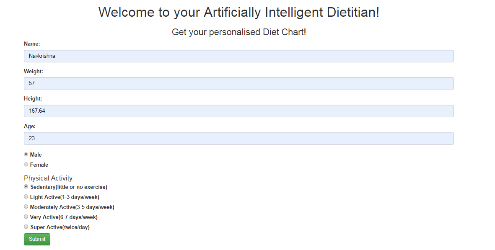
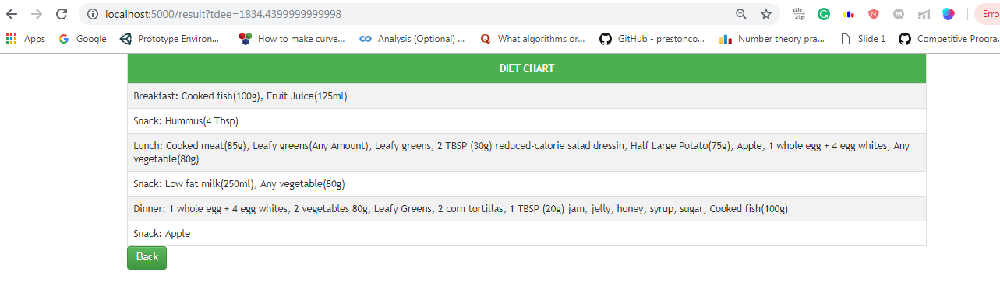

# Diet-Recommendation-App
Recommends a balanced diet based on user information.

# Install Requirements by:
```
pip install -r requirements.txt
```

# Formula Used:

TDEE, total daily energy expenditure, is the amount of energy in calories you burn per day. TDEE is best calculated by factoring in your BMR, or basal metabolic rate, and your activity level. BMR is the amount of calories you would burn per day at rest.

The Harris-Benedict formula is based on gender, a person’s weight, height, and age:
```
Male: BMR = 66 + (13.7 x weight in kg) + (5 x height in cm) – (6.8 x age in years)

Female: BMR = 655 + (9.6 x weight in kg) + (1.8 x height in cm) – (4.7 x age in years)
```
TDEE is calculated by multiplying BMR with Activity Factor depending on Physical Activity
Activity Multiplier:
```
Sedentary = BMR x 1.2 (little or no exercise, desk job)

Lightly active = BMR x 1.375 (light exercise/ sports 1-3 days/week)

Moderately active = BMR x 1.55 (moderate exercise/ sports 6-7 days/week)

Very active = BMR x 1.725 (hard exercise every day, or exercising 2 xs/day)

Extremely active = BMR x 1.9 (hard exercise 2 or more times per day)
```

Each food is categorised in the following categories:
* Protein
* Fruit
* Vegetable
* Grains
* Protein Snack

The result is displayed as meals using balanced combination of these food depending on the TDEE of a person.

# Demo

## Home Page:



## Result Page:

